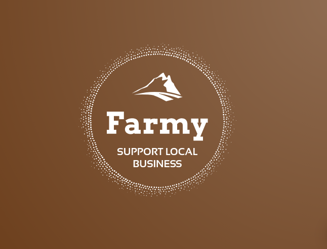

[](https://github.com/prettier/prettier)
[](https://gitlab.com/calvin-puram/farmy/-/blob/master/LICENSE)

An ongoing project

## About Farmy



Farmy is an efficient AgricEcommerce solution where everyone can buy fresh agricultural products directly from farmers and allow farmers to sell their products with no extra fees in between. It is an online market for buyers and sellers, but exclusively for the agricultural sector

Here's why:

- Middlemen intervention raise price for consumers. Farmers encounter high production costs in their efforts to boost production but hardly get fair pricing of their products from the middlemen. This attitude of middle men have discouraged genuine investors getting into agriculture because of the marginal profit associated with it as the middle men cart away the bulk of the profits. Thus, the activities of middlemen seem to be a threat to food security.

- Farmy allows farmers to freely list their produce and allows potential sellers to go through them. The buyer can list the quantity of the produce. Location of the buyer is also listed. Sellers can browse through the listed products and contact the buyer directly.

### Backend API Built With

List of major frameworks use to build getIdea.

- [Nodejs](https://nodejs.org/en/)
- [Redis](https://redis.io/)
- [Expressjs](https://expressjs.com/)
- [Mongodb](https://www.mongodb.com/)

### API Server

<!-- **NOTE: The full API documentation can be found [here](https://documenter.getpostman.com/view/5936515/TVmJgy8R)** -->

- API:
  - [x] Authentication system - [express-session](https://www.npmjs.com/package/express-session)
    - [x] Sign up - [bcrypt](https://www.npmjs.com/package/bcrypt)
    - [x] login
  - [x] Authorization system
    - [x] Role-based access control
    - [x] Principle of least privilege
  - [x] Input validation and sanitization - [validator](https://www.npmjs.com/package/validator)
  - [x] Integration testing - [jest](https://jestjs.io/) - [supertest](https://www.npmjs.com/package/supertest)
  - [x] Docker support - [node](https://hub.docker.com/_/node)
    - [x] Prod mode - See [server/Dockerfile](https://gitlab.com/calvin-puram/product-store/-/blob/master/server/Dockerfile)
  - [x] API Security
    - [x] The API is protected with express-session. This allows the application to identify authorized users and restrict access to data for unauthorised users
    - [x] Passwords have also been hashed with strong a crypto-algorithm.
    - [x] A structure has been established for the implementation of rate-limiting, to circumvent DOS security vulnerabilities with the system.
    - [x] user inputs are sanitized against xss and Nosql injection

## Getting started

### 1. Clone the repository

```bash
git clone https://gitlab.com/calvin-puram/farmy.git
cd farmy
cp .env.example /.env
# Edit all three .env files to meet your requirements
```

### 2. Install package dependencies

In the `root` directory, run:

```bash
npm install
```

### 3. Start development servers

You can start the server using `docker-compose`:

```bash
docker-compose up -d
```
